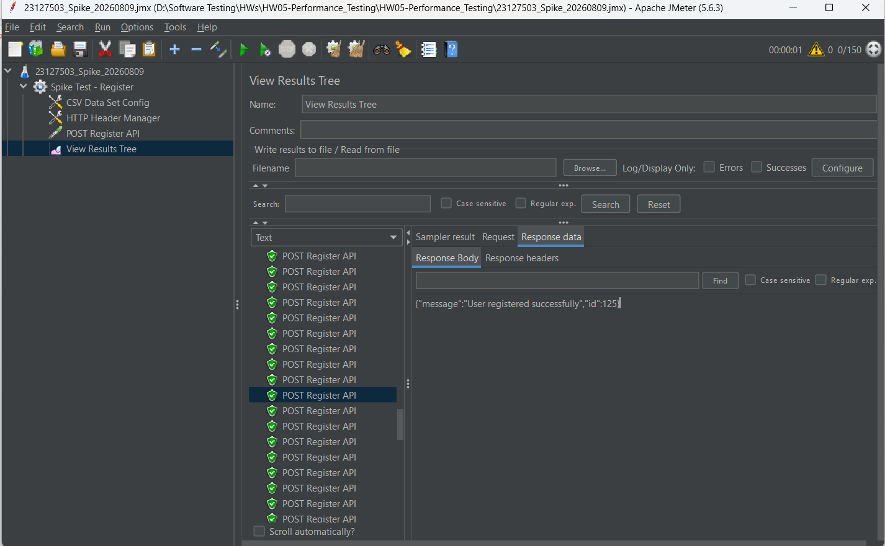
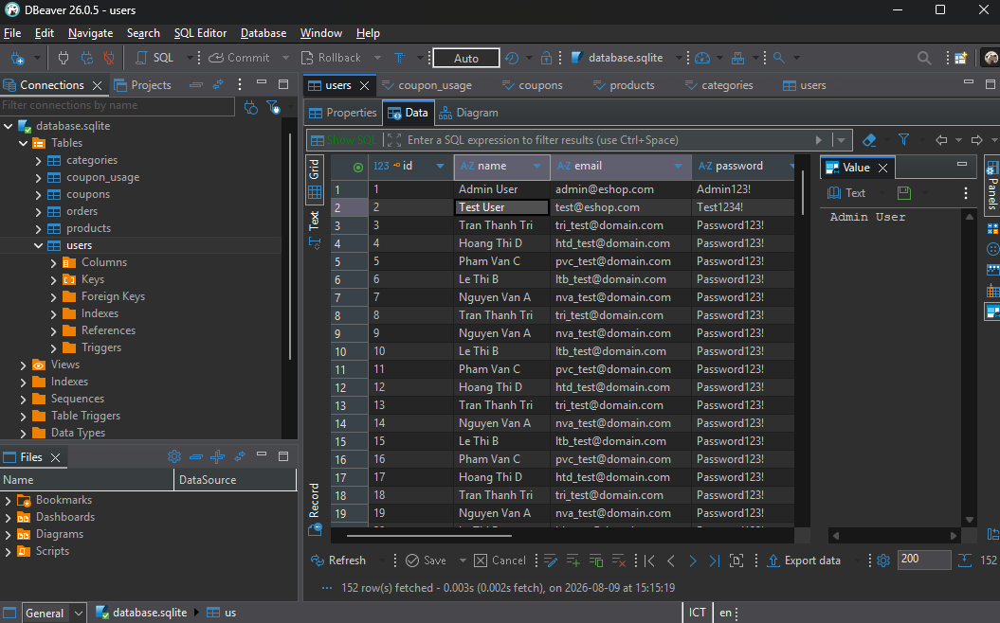

# Bug & Performance Issues Report

## Issue 1: [Functional Bug] Hệ thống cho phép đăng ký hàng loạt tài khoản trùng Email

- **Endpoint:** `POST /api/register`

- **Type:** Functional Bug / Security Issue

- **Description:** Trong quá trình chạy Spike Test với 150 Threads sử dụng cùng một địa chỉ email tĩnh (do kịch bản AI sinh ra), toàn bộ 150 requests đều trả về `200 OK - User registered successfully`. Kiểm tra lại Database cho thấy hệ thống đã thực sự tạo ra 150 user khác nhau (ID khác nhau) nhưng dùng chung một địa chỉ Email. Hệ thống đã thiếu sót hoàn toàn việc kiểm tra Unique Constraint ở tầng Database và Validation ở Backend, gây rủi ro lớn về bảo mật và quản lý định danh.

- **GitHub Issue Link:** https://github.com/Triszz/HW05-Performance_Testing/issues/1

- **Evidence (Screenshot):**

  

  

---

## Issue 2: [Security/Critical Bug] Mật khẩu người dùng lưu dưới dạng Plain-text (Không mã hóa)

- **Endpoint:** `POST /api/register`

- **Type:** Security Vulnerability / Architectural Flaw

- **Description:** Qua quá trình chạy Spike Test và đối chiếu với mức tiêu thụ CPU thấp bất thường (chỉ 11%), em đã tiến hành kiểm tra dữ liệu trực tiếp dưới Database (SQLite). Kết quả phát hiện toàn bộ mật khẩu người dùng đều được lưu trữ ở định dạng văn bản thuần túy (Plain-text, ví dụ: `Password123!`) mà không trải qua bất kỳ thuật toán băm (hashing) nào (như bcrypt hay Argon2). Đây là lỗ hổng bảo mật cực kỳ nghiêm trọng (Thuộc danh mục OWASP Top 10 - Cryptographic Failures). Về mặt hiệu năng, việc bỏ sót logic mã hóa này chính là nguyên nhân làm sai lệch kết quả kiểm thử, khiến CPU không bị dội tải (bottleneck) như kỳ vọng ban đầu của kịch bản Auth-heavy.

- **GitHub Issue Link:** https://github.com/Triszz/HW05-Performance_Testing/issues/2

- **Evidence (Screenshot):**

  
