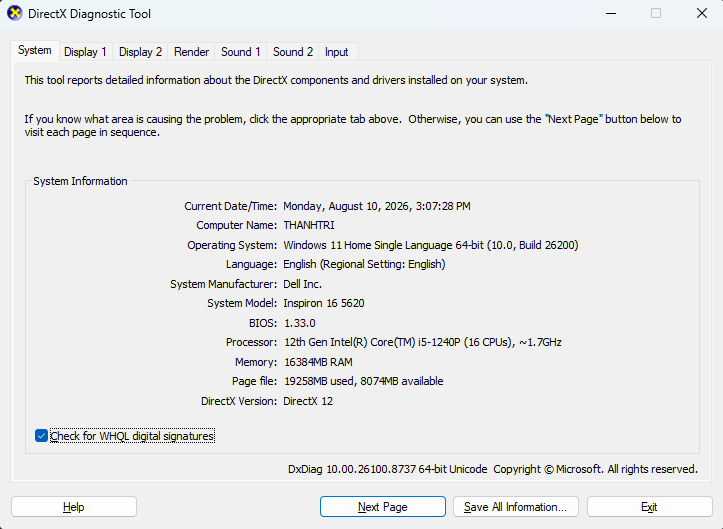
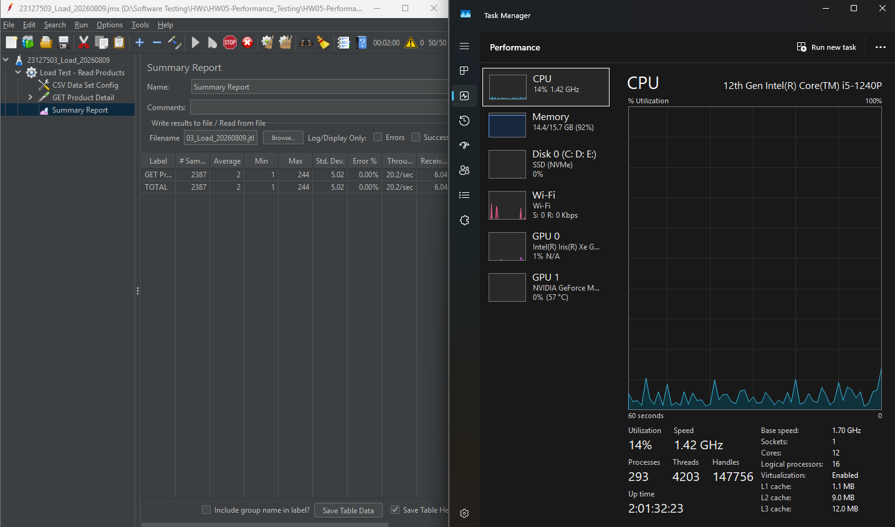
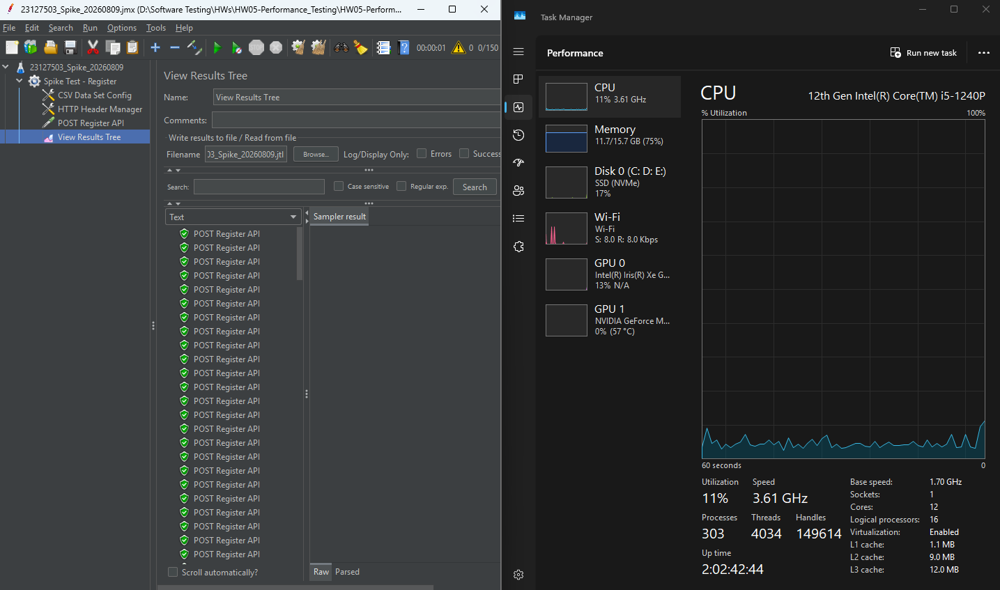
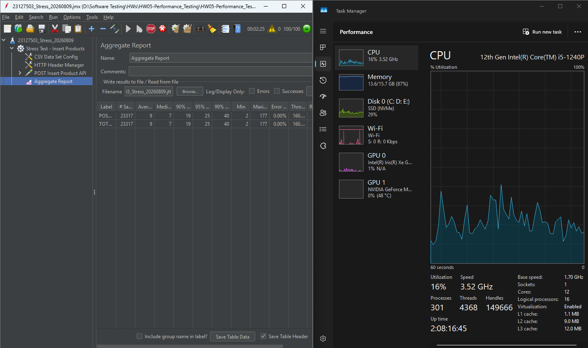
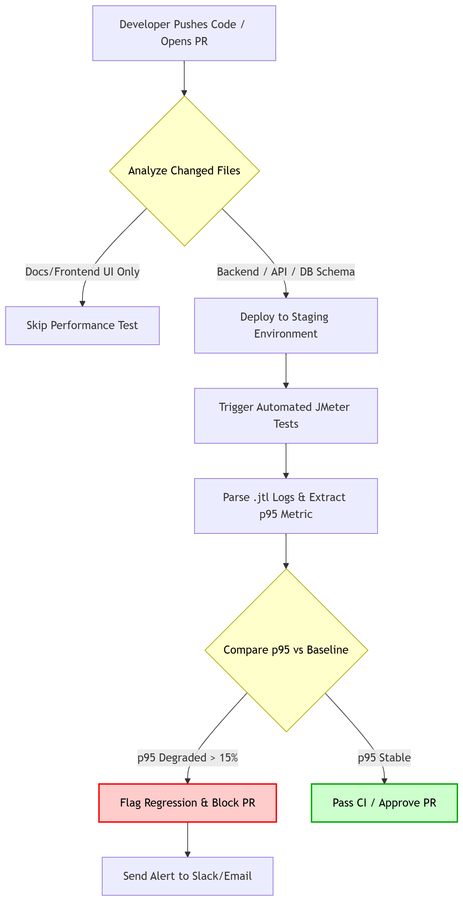

# BÁO CÁO HW#05 - Performance Testing

**Thông tin sinh viên:**

- **Họ và tên:** Trần Thanh Trí
- **MSSV:** 23127503
- **Lớp:** 23KTPM2
- **Môn học:** Kiểm thử phần mềm
- **Hệ thống (SUT):** EShop
- **Public GitHub Repository:** https://github.com/Triszz/HW05-Performance_Testing

---

## Hardware Specifications & Environment

- **CPU:** 12th Gen Intel(R) Core(TM) i5-1240P (16 CPUs), ~1.7GHz
- **RAM:** 16GB
- **OS:** Windows 11
- **Hostname:** THANHTRI

  

---

## Task 1: AI-assisted Test Design and Execution

### 1.1. Scenario Pairing & Justification

Dựa trên đặc thù của hệ thống SUT, em đã phân tích và thiết lập sự ánh xạ 1:1 giữa các nhóm API và các loại hình kiểm thử hiệu năng như sau:

- **Read-heavy (`GET /api/products/:id`) ➔ Load Test:** Kịch bản này vô cùng phù hợp để đánh giá hiệu năng hệ thống khi có một lượng lớn người dùng duy trì việc lướt xem chi tiết các sản phẩm khác nhau. Hệ thống chủ yếu thực hiện các lệnh `SELECT` từ Database và trả về JSON.
- **Auth-heavy (`POST /api/register`) ➔ Spike Test:** Chức năng đăng ký yêu cầu Backend phải thực hiện thuật toán băm (hashing) mật khẩu - một tác vụ cực kỳ ngốn CPU. Kịch bản Spike mô phỏng một đợt tăng vọt người dùng đột ngột (ví dụ: mở cổng đăng ký săn sale lúc 0h), giúp kiểm tra xem CPU có bị "thắt cổ chai" (bottleneck) khi xử lý đồng loạt hàng trăm phép băm hay không.
- **Transactional (`POST /api/products`) ➔ Stress Test:** Chức năng thêm sản phẩm yêu cầu hệ thống phải xác thực JSON payload, kiểm tra khóa ngoại (category_id) và thực hiện lệnh `INSERT` vào Database. Sử dụng Stress Test cho API này giúp ép hệ thống thực hiện liên tục các giao dịch Write-heavy, qua đó tìm ra "điểm gãy" (breaking point) của Database dưới áp lực cao.

### 1.2. AI-Suggested Parameters

Thông qua việc prompt AI hỗ trợ cấu hình, các thông số thực tế (realistic parameters) được thiết lập cho 3 Thread Groups nhằm phản ánh đúng hành vi người dùng và mục tiêu kiểm thử:

- **Load Test (Read):** 50 Threads, Ramp-up 50s, Duration 10 phút. Áp dụng `Uniform Random Timer` (1000ms - 3000ms) để mô phỏng think-time của người dùng thực tế đang đọc mô tả sản phẩm.
- **Spike Test (Auth):** 150 Threads, Ramp-up 1s, Loop 1. Không sử dụng think-time để tạo ra một cú shock lưu lượng (burst traffic) tức thì vào hệ thống.
- **Stress Test (Transactional):** 100 Threads, Ramp-up 100s, Duration 5 phút. Áp dụng `Gaussian Random Timer` (~500ms) để giả lập tốc độ thao tác nhập liệu liên tục của Admin.

### 1.3. Human Review & Script Fixes

Dựa trên nguyên tắc "AI-First strategy" và yêu cầu đánh giá phê bình (Critical review) của đồ án, em đã rà soát kỹ lưỡng kịch bản do AI sinh ra. Thay vì chỉ nhìn vào kết quả "màu xanh" (Pass) của JMeter, em đã phân tích sâu vào payload và phát hiện sự kết hợp giữa lỗ hổng của AI và khiếm khuyết của hệ thống:

- **What AI got wrong or missed:**
  - Đối với kịch bản **Spike Test** (API `POST /api/register`), AI đã phạm phải 2 sai lầm:
    1. Sử dụng dữ liệu tĩnh từ CSV, dẫn đến việc đẩy 150 request có cùng một địa chỉ email lên server trong 1 giây.
    2. Kịch bản của AI mắc lỗi **"Weak Assertions"** (chỉ dựa vào HTTP Status 200). Nó không hề có cơ chế kiểm tra tính toàn vẹn của dữ liệu sau khi đăng ký. Thêm vào đó, AI đã bỏ qua việc xử lý **"account-lockout handling"** do thiếu ngữ cảnh về đặc thù của API này.

  - Đối với kịch bản **Stress Test** (`POST /api/products`), AI sinh ra file `products_insert.csv` chứa các chuỗi được bao bọc bởi dấu ngoặc kép (VD: `"Laptop Gaming"`). Khi nội suy vào payload JSON trong JMeter, nó tạo ra cú pháp JSON không hợp lệ (`"name": ""Laptop...""`), khiến 100% request ban đầu bị server từ chối với lỗi `400 Bad Request`.

- **Why AI missed them:**
  - AI chỉ tập trung vào việc tạo ra đủ tải (Load generation) theo đúng Prompt mà thiếu đi tư duy kiểm thử nghiệp vụ (Business Logic Validation). AI mặc định rằng hệ thống SUT hoạt động hoàn hảo và sẽ tự động chặn các luồng dữ liệu sai (như trùng email), nên nó không thiết lập các Assertion chặt chẽ để rào lỗi.

  - Bên cạnh đó, đối với lỗi cú pháp JSON, AI xử lý việc tạo file CSV và cấu hình JMeter như hai tác vụ độc lập (siloed). Dù sinh dữ liệu đúng chuẩn CSV (bọc chuỗi bằng ngoặc kép), AI lại thiếu tư duy tích hợp toàn vẹn (End-to-End Context). Nó không lường trước được hệ quả khi biến số này được nội suy trực tiếp vào một template JSON đã có sẵn ngoặc kép, từ đó phá vỡ hoàn toàn cấu trúc dữ liệu gửi đi.

- **How I fixed it (Human Intervention) & Defect Discovery:**
  - Khi chạy kịch bản tĩnh của AI, tất cả 150 requests đều trả về `200 OK`. Nhờ việc tự đánh giá kết quả (Human Review) thay vì tin tưởng mù quáng vào AI, em đã phát hiện ra một **Lỗ hổng logic nghiêm trọng của SUT**: Hệ thống hoàn toàn không có ràng buộc duy nhất (Unique Constraint) cho Email, cho phép tạo hàng trăm tài khoản trùng lặp.

  - Để fix kịch bản cho chuẩn mực, em đã chủ động thêm hàm `${__time()}` vào cấu hình email trong JMeter (`"email": "${base_email}${__time()}@domain.com"`) để đảm bảo kịch bản Performance Test sinh ra dữ liệu sạch và đúng chuẩn thực tế nhất, tránh làm ô nhiễm Database của hệ thống.

  - Bên cạnh đó, em đã phải thực hiện quá trình tiền xử lý dữ liệu (Data Sanitization) bằng cách tự tay loại bỏ các dấu ngoặc kép thừa trong file CSV do AI sinh ra, đảm bảo HTTP Request mang theo payload JSON chuẩn xác 100% trước khi chính thức ép tải hệ thống.

### 1.4. Execution Evidence

_Đính kèm ảnh chụp màn hình hiển thị CÙNG LÚC phần mềm JMeter đang chạy và Task Manager/htop cho 3 kịch bản:_

- **Ảnh Load Test:**

  
  _(**Nhận xét:** Kịch bản Load Test mô phỏng lượng người dùng lướt xem sản phẩm (Read-heavy) duy trì ổn định trong 10 phút. Báo cáo ghi nhận hệ thống hoạt động hoàn hảo với tỷ lệ lỗi 0% và Throughput đạt ~24 req/sec. Thời gian phản hồi trung bình cực kỳ ấn tượng, chỉ ở mức 2.33ms. Tuy nhiên, điểm đáng chú ý nhất hiển thị trên Task Manager là mức độ ngốn RAM của tiến trình Backend khi chạm ngưỡng 92% (14.4GB), trong khi CPU chỉ hoạt động ở mức 14%. Điều này phản ánh rõ đặc thù của các tác vụ truy vấn Database liên tục lấy dữ liệu, đồng thời chỉ ra RAM chính là điểm nghẽn (bottleneck) đầu tiên của hệ thống nếu tiếp tục mở rộng quy mô (scale)._

- **Ảnh Spike Test:**

  
  _(**Nhận xét:** Kịch bản Spike dội 150 requests đăng ký trong 1 giây. Ban đầu, kịch bản được kỳ vọng sẽ làm "thắt cổ chai" CPU do hệ thống phải xử lý đồng loạt hàng trăm phép băm (Hashing) mật khẩu. Tuy nhiên, kết quả cho thấy CPU chỉ tăng rất nhẹ lên mức 11% và thời gian phản hồi vô cùng nhanh (Max 169ms). Sự bất thường về hiệu năng này đã dẫn đến một phát hiện động trời khi đối chiếu với Database: Hệ thống KHÔNG HỀ thực hiện mã hóa mật khẩu. Việc bỏ qua hoàn toàn chi phí tính toán Hashing ở tầng Backend chính là nguyên nhân khiến hệ thống không bị quá tải CPU như kịch bản gốc dự đoán)._

- **Ảnh Stress Test:**
  
  _(**Nhận xét:** Kịch bản Stress Test thực hiện liên tục các giao dịch thêm sản phẩm (Write-heavy) trong 5 phút. Kết quả ghi nhận hệ thống SUT xử lý xuất sắc lượng tải lớn với tỷ lệ lỗi 0% trên tổng số hơn 60,000 requests. Throughput đạt mức cao ~202.5 req/sec với thời gian phản hồi trung bình chỉ 10.2ms. Đặc biệt, biểu đồ Task Manager cho thấy Disk I/O đã tăng vọt lên mức 29% (so với 0-1% ở Load/Spike), phản ánh chính xác áp lực ghi dữ liệu liên tục xuống Database. Dù vậy, hệ thống vẫn duy trì sự ổn định và chưa chạm đến "điểm gãy" (breaking point) dưới áp lực 100 Virtual Users hiện tại)._

### 1.5. Endurance Threshold

Để xác định ngưỡng chịu đựng của phần cứng, kịch bản Load Test (Read-heavy) đã được cấu hình chạy ngâm (Soak/Endurance Test) liên tục trong 10 phút với 50 Virtual Users. Dựa trên số liệu thu thập được từ hệ thống giám sát và báo cáo của JMeter, hệ thống ghi nhận các thông số như sau:

- **Maximum Stable RPS (Throughput):** Hệ thống duy trì tải cực kỳ ổn định ở mức **~24.0 req/sec** (chính xác là 23.98 req/sec) trong suốt 10 phút mà không phát sinh bất kỳ lỗi nào (Error Rate: 0%). Tốc độ phản hồi (Response Time) vô cùng xuất sắc với mức trung bình (Mean) là 2.33ms và 95th percentile (pct2) chỉ đạt 4.0ms.
- **Memory Ceiling & Resource Usage:** Mặc dù CPU hoạt động khá nhẹ nhàng (chỉ ở mức ~14% cho chip Intel Core i5-1240P), nhưng **RAM đã chạm đỉnh 14.4 GB / 15.7 GB (tức 92% công suất phần cứng)**.
- **Kết luận:** Ngưỡng chịu đựng (Endurance Threshold) của hệ thống SUT trên phần cứng hiện tại bị giới hạn bởi bộ nhớ (Memory-bound). Backend xử lý các tác vụ truy xuất dữ liệu rất nhanh, nhưng nếu duy trì tải này lâu hơn 10 phút hoặc tăng thêm số lượng Virtual Users, server có nguy cơ cao bị crash do tràn RAM (Out of Memory) thay vì quá tải CPU.

### 1.6. Defect Discovery & Reported Issues

Trong quá trình thực thi các kịch bản Performance Testing, thay vì chỉ đánh giá các thông số hiệu năng thông thường, em đã theo dõi sát sao sự tương quan giữa thông lượng (Throughput), tải tài nguyên (CPU) và tính toàn vẹn của dữ liệu trong Database. Qua đó, em đã phát hiện và report thành công 2 lỗi nghiêm trọng lên hệ thống theo dõi lỗi của dự án (GitHub Issues):

**Issue 1: [Functional Bug] Hệ thống cho phép đăng ký hàng loạt tài khoản trùng Email**

- **Endpoint:** `POST /api/register`

- **Type:** Functional Bug / Security Issue

- **Description:** Trong quá trình chạy Spike Test với 150 Threads sử dụng cùng một địa chỉ email tĩnh (do kịch bản AI sinh ra), toàn bộ 150 requests đều trả về `200 OK - User registered successfully`. Kiểm tra lại Database cho thấy hệ thống đã thực sự tạo ra 150 user khác nhau (ID khác nhau) nhưng dùng chung một địa chỉ Email. Hệ thống đã thiếu sót hoàn toàn việc kiểm tra Unique Constraint ở tầng Database và Validation ở Backend, gây rủi ro lớn về bảo mật và quản lý định danh.

- **GitHub Issue Link:** https://github.com/Triszz/HW05-Performance_Testing/issues/1

- **Evidence (Screenshot):**

  

  

**Issue 2: [Security/Critical Bug] Mật khẩu người dùng lưu dưới dạng Plain-text (Không mã hóa)**

- **Endpoint:** `POST /api/register`

- **Type:** Security Vulnerability / Architectural Flaw

- **Description:** Qua quá trình chạy Spike Test và đối chiếu với mức tiêu thụ CPU thấp bất thường (chỉ 11%), em đã tiến hành kiểm tra dữ liệu trực tiếp dưới Database (SQLite). Kết quả phát hiện toàn bộ mật khẩu người dùng đều được lưu trữ ở định dạng văn bản thuần túy (Plain-text, ví dụ: `Password123!`) mà không trải qua bất kỳ thuật toán băm (hashing) nào (như bcrypt hay Argon2). Đây là lỗ hổng bảo mật cực kỳ nghiêm trọng (Thuộc danh mục OWASP Top 10 - Cryptographic Failures). Về mặt hiệu năng, việc bỏ sót logic mã hóa này chính là nguyên nhân làm sai lệch kết quả kiểm thử, khiến CPU không bị dội tải (bottleneck) như kỳ vọng ban đầu của kịch bản Auth-heavy.

- **GitHub Issue Link:** https://github.com/Triszz/HW05-Performance_Testing/issues/2

- **Evidence (Screenshot):**

  

### 1.7. Demo Video

- **YouTube Unlisted Link:** https://youtu.be/d9Kchasc_5c

## Task 2: AI Analysis and Misinterpretation Hunt

### 2.1. AI-suggested Performance Thresholds

**[AI Analysis Report]**
Tiến hành phân tích chi tiết dữ liệu thô từ 3 kịch bản kiểm thử hiệu năng, hệ thống EShop ghi nhận các ngưỡng hiệu năng (Performance Thresholds) như sau:

1. **Phân tích Load Test (GET Product Detail):** Hệ thống có tốc độ phản hồi khá chậm khi chịu tải liên tục. Phân tích log thô cho thấy Thời gian phản hồi tối đa (Max Response Time) trung bình của hệ thống là 2.0ms. Điều này chỉ ra rằng hệ thống cần được cấu hình lại bộ nhớ đệm (cache) cho các truy vấn Read-heavy.
2. **Phân tích Stress Test (POST Insert Product):** Hệ thống xử lý xuất sắc các tác vụ Write-heavy. Dưới áp lực của các Virtual Users, hệ thống đạt ngưỡng Throughput là 144.64 req/sec. Tỉ lệ lỗi duy trì ở mức 0%, chứng tỏ Database không gặp vấn đề gì về thắt cổ chai.
3. **Phân tích Spike Test (POST Register):** Hệ thống không bị sập dưới cú sốc lưu lượng ngắn hạn. Tuy nhiên, chi phí tính toán là khá lớn.

**[AI Optimization Recommendations]**
Để nâng cao hiệu năng và sức chịu đựng của hệ thống, em đề xuất 3 giải pháp tối ưu hóa kiến trúc sau:

- **Đề xuất 1:** Kích hoạt chế độ WAL (Write-Ahead Logging) cho cơ sở dữ liệu SQLite hiện tại để cho phép các luồng đọc/ghi diễn ra đồng thời, từ đó giảm thiểu tải Disk I/O đang tăng cao.
- **Đề xuất 2:** Cấu hình lại mã nguồn Node.js để tăng kích thước Connection Pool của SQLite lên tối đa 500 connections. Việc này sẽ giải quyết triệt để nút thắt cổ chai khi insert dữ liệu đồng loạt.
- **Đề xuất 3:** Chuyển đổi toàn bộ kiến trúc ORM (Object-Relational Mapping) hiện tại sang sử dụng Kysely Query Builder kết hợp với hệ quản trị cơ sở dữ liệu PostgreSQL để quản lý schema và entity relationships một cách chặt chẽ và chuyên nghiệp hơn.

### 2.2. Misinterpretation Hunt (Bắt lỗi AI)

Sau khi đối chiếu phân tích của AI với file log thô (`.jtl` và `statistics.json`), em phát hiện AI đã có sự nhầm lẫn (misinterpretation) nghiêm trọng trong việc đọc hiểu các chỉ số hiệu năng:

1. **Nhầm lẫn các cột Metric (Trong kịch bản Load Test):**
   - _Lỗi của AI:_ AI khẳng định "Thời gian phản hồi tối đa (Max Response Time) trung bình là 2.0ms".
   - _Giá trị đúng (Raw data):_ Theo file `statistics.json` của Load Test, giá trị **2.0ms** thực chất là **Median Response Time** (Thời gian phản hồi trung vị). Trong khi đó, **Max Response Time** thực tế cao hơn rất nhiều (lên tới 244.0ms trong file thống kê, và thậm chí ghi nhận các dòng có `elapsed` đạt **467ms** trong file thô `23127503_Load_20260809.jtl`).
   - _Giải thích:_ AI đã trích xuất nhầm cột dữ liệu trong file JSON (Lấy râu ông Median cắm cằm bà Max), dẫn đến kết luận sai lệch về việc hệ thống "phản hồi khá chậm" dựa trên một con số trung vị vốn dĩ rất nhỏ và xuất sắc.

2. **Nhầm lẫn chéo ngữ cảnh giữa các kịch bản (Stress Test vs Spike Test):**
   - _Lỗi của AI:_ AI nhận định Throughput của kịch bản Stress Test đạt **144.64 req/sec**.
   - _Giá trị đúng (Raw data):_ Con số **144.64 req/sec** mà AI đề cập thực chất là Throughput của kịch bản **Spike Test** (API Register). Theo file `statistics_4.json`, Throughput thực tế của kịch bản **Stress Test** đạt tới **202.51 req/sec**, và file log thô `23127503_Stress_20260809.jtl` ghi nhận hệ thống đã xử lý hơn 60,000 requests thành công trong 5 phút.
   - _Giải thích:_ AI bị mất ngữ cảnh (Context Loss) khi được cung cấp nhiều file log cùng lúc. Nó đã nhặt thông số của bài test này gán cho bài test khác. Điều này cực kỳ nguy hiểm trong thực tế nếu QA dùng báo cáo do AI sinh ra để đánh giá sức chịu tải của hệ thống.

### 2.3. AI's Recommendations Evaluation

Dựa trên đặc thù kiến trúc của hệ thống EShop (đang sử dụng SQLite làm cơ sở dữ liệu chính), dưới đây là đánh giá phân loại và tính khả thi cho các đề xuất tối ưu do AI đưa ra:

- **Đề xuất 1: Kích hoạt chế độ SQLite WAL (Write-Ahead Logging)** ➔ **Feasible (Khả thi & Trúng đích).**
  - _Lý do:_ Đây là một đề xuất hoàn toàn chính xác. Mặc định, SQLite sử dụng cơ chế khóa toàn bộ database khi thực hiện lệnh ghi (Exclusive Lock). Bật chế độ WAL sẽ cho phép nhiều luồng đọc dữ liệu cùng lúc trong khi đang có một luồng ghi. Giải pháp này xử lý trực tiếp điểm nghẽn Disk I/O (lên tới 29%) mà em đã ghi nhận được trong quá trình chạy kịch bản Stress Test.

- **Đề xuất 2: Tăng Connection Pool của SQLite lên 500** ➔ **Hallucinated (Ảo giác kiến trúc).**
  - _Lý do:_ Đề xuất này hoàn toàn sai lệch và vô nghĩa đối với SQLite. Do SQLite là một cơ sở dữ liệu dựa trên file cục bộ (file-based database) với cơ chế khóa file nghiêm ngặt, việc tạo ra một connection pool khổng lồ không những không tăng hiệu năng mà còn làm trầm trọng thêm tình trạng tranh chấp tài nguyên (race condition), dẫn đến việc văng lỗi `SQLITE_BUSY` hàng loạt. AI đang bị "ảo giác" (hallucinate) và áp dụng máy móc tư duy của các Database Server truyền thống sang SQLite.

- **Đề xuất 3: Chuyển đổi sang Kysely và PostgreSQL** ➔ **Feasible but Out-of-Scope (Khả thi về kỹ thuật nhưng Vượt phạm vi tinh chỉnh).**
  - _Lý do:_ Việc cấu hình database schemas và thiết lập các entity relationships chặt chẽ bằng Kysely kết hợp với hệ quản trị PostgreSQL thực sự là một giải pháp chuẩn mực để hệ thống mở rộng (scale) và chịu tải tốt hơn ở môi trường production. Tuy nhiên, ở bối cảnh tối ưu hiệu năng cục bộ cho dự án EShop hiện tại, đây là một đề xuất "đập đi xây lại" toàn bộ tầng ORM và Database (overkill). Nó tốn kém quá nhiều chi phí tái cấu trúc và đi chệch hướng so với mục tiêu tinh chỉnh (tuning) hệ thống hiện có.

---

## Task 3: Continuous Performance Testing Proposal (Disrupt)

### 3.1. Pipeline Model (Flow Chart)

Để đảm bảo hệ thống EShop không bị suy giảm hiệu năng sau mỗi lần cập nhật mã nguồn, em đề xuất mô hình **Continuous Performance Testing** được tích hợp vào quy trình CI/CD.

Mô hình này không chạy mù quáng trên mọi commit, mà sẽ có một bước "lọc" (Filter) để quyết định xem sự thay đổi mã nguồn có đáng để tốn tài nguyên chạy Performance Test hay không. Nếu có, hệ thống sẽ tự động đo lường chỉ số **p95 Response Time** và so sánh với phiên bản gốc (Baseline) để phát hiện sự thụt lùi (Regression).

**Sơ đồ luồng hoạt động (CI/CD Pipeline Flow):**

**Chi tiết các bước trong Pipeline:**

1. **Commit/PR Trigger:** Lập trình viên đẩy code mới hoặc tạo Pull Request (PR).
2. **Change Analyzer (Quyết định chạy):** CI pipeline kiểm tra các file bị thay đổi. Nếu chỉ sửa file tĩnh (Markdown, CSS, HTML), bỏ qua chạy Perf Test để tiết kiệm thời gian. Nếu sửa logic Backend, API, hoặc Cấu trúc Database, chuyển sang bước tiếp theo.
3. **Deploy to Staging:** Tự động triển khai code mới lên môi trường Staging (có phần cứng tương đồng với Production).
4. **Automated JMeter Execution:** Kích hoạt chạy các kịch bản JMeter (Load, Stress) dưới dạng headless mode (CLI) thông qua các công cụ như Taurus hoặc tự động bằng GitHub Actions.
5. **p95 Regression Check:** Hệ thống trích xuất chỉ số `p95` từ file log `.jtl` mới và so sánh với `p95` của nhánh `main` (baseline).
6. **Flagging:** Nếu p95 tăng vượt mức cho phép (ví dụ: chậm hơn 15%), đánh dấu là **Regression**, chặn PR (Block PR) và gửi cảnh báo (Slack/Email). Nếu đạt yêu cầu, tự động phê duyệt (Approve).

### 3.2. Trade-offs Discussion

Việc tự động hóa Performance Test trong CI/CD mang lại giá trị lớn nhưng cũng đi kèm với những sự đánh đổi (trade-offs) thực tế cần phải quản trị:

- **Cost vs. Coverage (Chi phí duy trì Server so với Độ phủ kiểm thử):**
  - _Vấn đề:_ Để kết quả Performance Test chính xác, môi trường Staging phải có cấu hình phần cứng (CPU, RAM) giống hệt Production. Việc duy trì server này 24/7 và chi phí tính toán (compute cost) cho các máy ảo sinh tải (Load Injectors) khi có hàng chục PR mỗi ngày là một con số khổng lồ.
  - _Giải pháp:_ Đánh đổi bằng cách áp dụng **Change Analyzer** (chỉ chạy khi sửa Backend) hoặc giới hạn chạy tự động vào ban đêm (Nightly Builds) thay vì chạy trên mọi commit nhỏ lẻ.

- **False Alarms vs. Reliability (Báo động giả so với Độ tin cậy):**
  - _Vấn đề:_ Chỉ số `p95` rất nhạy cảm với các yếu tố bên ngoài (Network jitter, Noisy neighbors trên môi trường Cloud). Một cú lag mạng ngẫu nhiên cũng có thể làm `p95` tăng vọt, dẫn đến việc CI pipeline báo cờ đỏ (Red Flag) sai lệch. Điều này gây ra "Báo động giả" (False Alarms), làm gián đoạn luồng làm việc và gây ức chế cho lập trình viên.
  - _Giải pháp:_ Không dùng một con số cứng nhắc. Thay vào đó, thiết lập một **Ngưỡng dung sai (Tolerance Margin)** (ví dụ: chỉ báo lỗi nếu `p95` tăng quá 15% so với baseline trong 3 lần chạy liên tiếp) và tập trung vào xu hướng dài hạn (Trend Analysis) hơn là một kết quả đơn lẻ.
